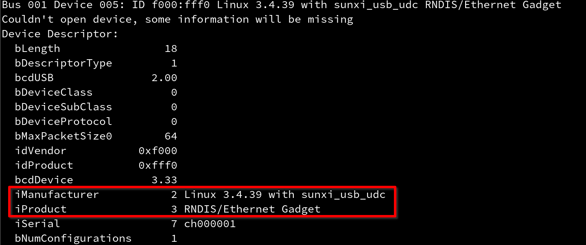
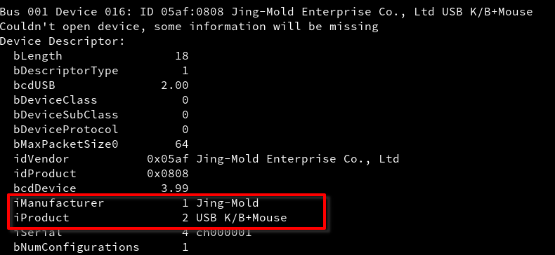

<p align="center">
  
</p>

## Description
**StealthBunny** is  a tool designed to modify HAK5's BashBunny USB gadget kernel driver to remove possible indicators of compromise. BashBunny leverages a closed-source kernel driver at `/usr/local/bunny/lib/bunny_gadget.ko` to build the system gadget and clone various USB devices. However, this driver fails to allow for mixed-case and special characters resulting in unfortunate IoCs.

The default gadget configuration will *always* display the iManufacturer as `RNDIS/Ethernet Gadget`:
<p align="left">
  
</p>

To correct this behavior, I have identified error strings in the gadget file that are infrequently used. These have been replaced and the string calls have been modified, to allow for the `iManufacturer` and `iProduct` values to be customized. Resulting in a clean gadget device:
<p align="left">
  
</p>

**NOTE**: This configuration represents Diebold Nixdorf's default ATM keyboard HID device ;)..

## Useage
```
$ ./sbunny       
 @@@@@@   @@@@@@@  @@@@@@@@   @@@@@@   @@@     @@@@@@@  @@@  @@@       @@@@@@@   @@@  @@@  @@@  @@@  @@@  @@@  @@@ @@@  
@@@@@@@   @@@@@@@  @@@@@@@@  @@@@@@@@  @@@     @@@@@@@  @@@  @@@       @@@@@@@@  @@@  @@@  @@@@ @@@  @@@@ @@@  @@@ @@@  
!@@         @@!    @@!       @@!  @@@  @@!       @@!    @@!  @@@   ~   @@!  @@@  @@!  @@@  @@!@!@@@  @@!@!@@@  @@! !@@  
!@!         !@!    !@!       !@!  @!@  !@!       !@!    !@!  @!@  ~~~  !@   @!@  !@!  @!@  !@!!@!@!  !@!!@!@!  !@! @!!  
!!@@!!      @!!    @!!!:!    @!@!@!@!  @!!       @!!    @!@!@!@! ~~~~~ @!@!@!@   @!@  !@!  @!@ !!@!  @!@ !!@!   !@!@!   
 !!@!!!     !!!    !!!!!:    !!!@!!!!  !!!       !!!    !!!@!!!! ~~~~~ !!!@!!!!  !@!  !!!  !@!  !!!  !@!  !!!    @!!!   
     !:!    !!:    !!:       !!:  !!!  !!:       !!:    !!:  !!!  ~~~  !!:  !!!  !!:  !!!  !!:  !!!  !!:  !!!    !!:    
    !:!     :!:    :!:       :!:  !:!   :!:      :!:    :!:  !:!   ~   :!:  !:!  :!:  !:!  :!:  !:!  :!:  !:!    :!:    
:::: ::      ::     :: ::::  ::   :::   :: ::::   ::    ::   :::        :: ::::  ::::: ::   ::   ::   ::   ::     ::    
:: : :       :     : :: ::    :   : :  : :: : :   :      :   : :       :: : ::    : :  :   ::    :   ::    :      :     
                                                                                              @emptynebuli
Usage:                    sbunny [ restore | <iManufacturer> <iProduct> ]
```

StealthBunny allows for modifying the `default_gadget.ko` file and restoring the file back to the original value. To modify the default gadget just pass in a string for `iManufacturer` and `iProduct`. Reversal is as simple as `sbunny restore`. To insure you don't accidently make your bunny unusable, I recommend restoring the kernel drive at the end of each payload script.

Copy StealthBunny to `/tools`, on the BashBunny, and call `sbunny` before executing `ATTACKMODE`. The following payload.txt file demonstrates proper use of StealthBunny:
```
LED B SLOW
sbunny 'Jing-Mold' 'USB K/B+Mouse'
ATTACKMODE HID VID_0x05af PID_0x0808

LED R FAST
sbunny restore
```